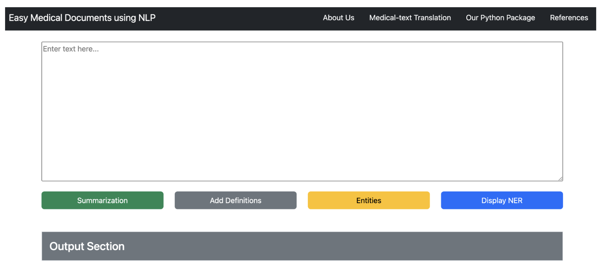

# ANLY521--Group-Project
Using NLP to better understand medical documents.
=======
# MedEase
MedEase is a tool that uses NLP to help users better understand medical text. This project is designed to help the average person who does not have strong medical knowledge understand medical text such as discharge notes, medical transcriptions, or any other type of medical text. MedEase is built using Python code and a Dash website.

## Installation
To use this project, you must first clone the repository:
```
$ git clone https://github.com/Clara-Richter/ANLY521--Group-Project.git
```

Create a Conda environment with the required packages. You can do this using the following command:
```
$ conda env create -f environment.yml
```

This will create a new Conda environment called '...' with all the required packages.

Next, go to project folder and activate the Conda environment using the following command
```
$ cd ANLY521--Group-Project
$ conda activate ...
```

Install MedEase:
```
$ pip install .
```

## Usage
To run the program, call main.py and the file path of the text file you want translated. There are 4 options you can run:

#### Summarize:
This will generate a summary printed in the terminal of the text file.
```
$ python3 Code/bin/main.py --indir Data/test_text.txt --...
```

#### Definitions:
This will generate the text with definitions for terms found in the text printed in the terminal.
```
$ python3 Code/bin/main.py --indir Data/test_text.txt --...
```

#### Entities:
This will generate a list in the terminal of the medical name entities and if they are a chemical or a disease.
```
$ python3 Code/bin/main.py --indir Data/test_text.txt --...
```

#### Display NER:
This will output a file called output.html in the root folder. The file will contain the highlighted medical name entities related to a chemical or disease in the text.
```
$ python3 Code/bin/main.py --indir Data/test_text.txt --...
```

## Website
Launch the website:
```
$ python3 dash/nlp_dash.py
```
MedEase is now running on http://127.0.0.1:8050/

Once you are on the website, you can input medical text into the text box provided. You can then choose from the following options:

<ins>Summarize</ins>: This option will generate a summary of the text you provided.   
<ins>Definitions</ins>: This option will provide definitions for medical terms found in the text you provided.  
<ins>Entities</ins>: This option will return a list of the medical name entities and if they are a chemical or a disease.  
<ins>Display NER</ins>: This option will label medical name entities related to a chemical or disease in the text you provided.   



